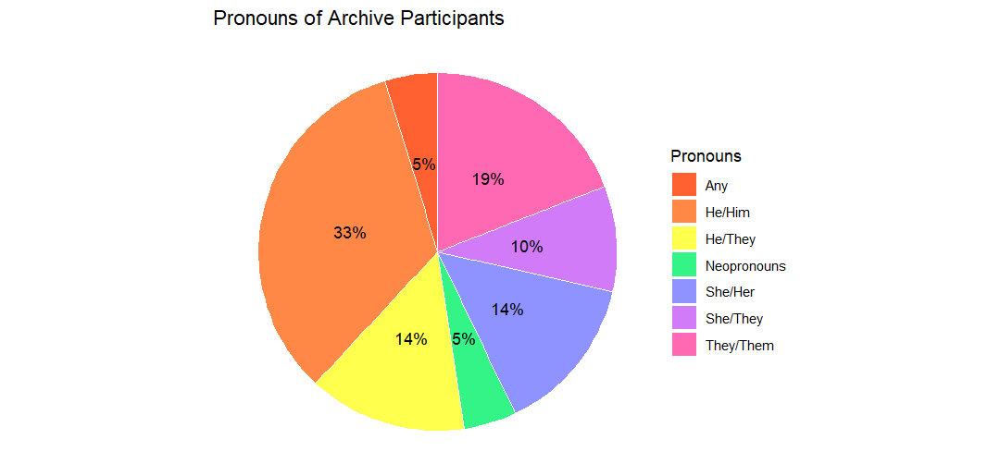
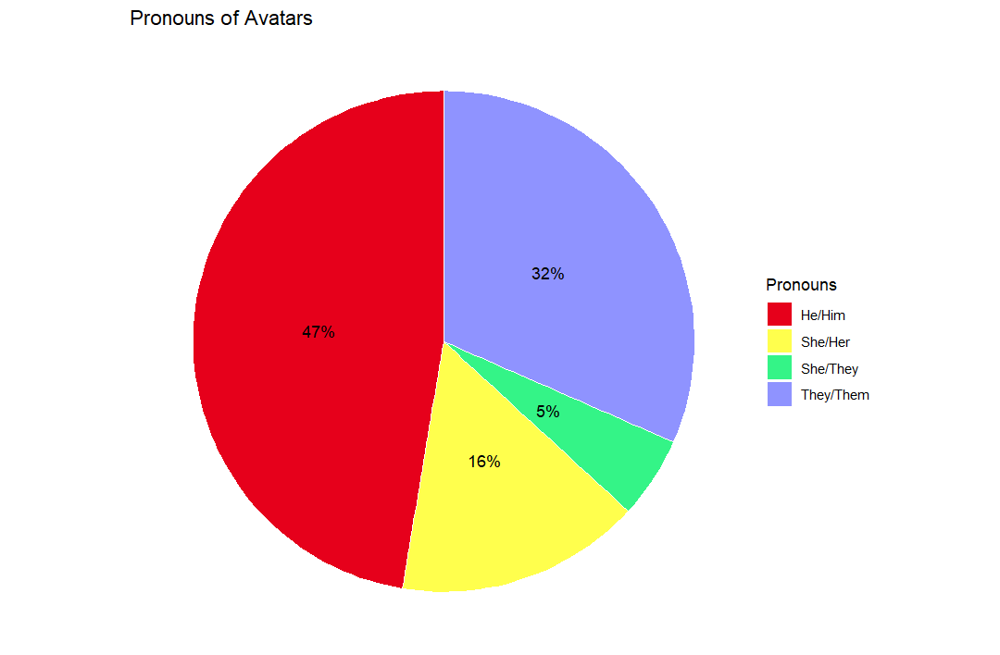
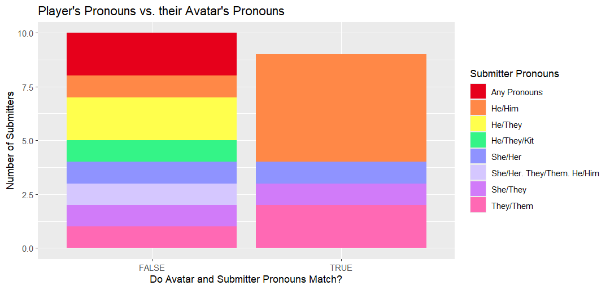
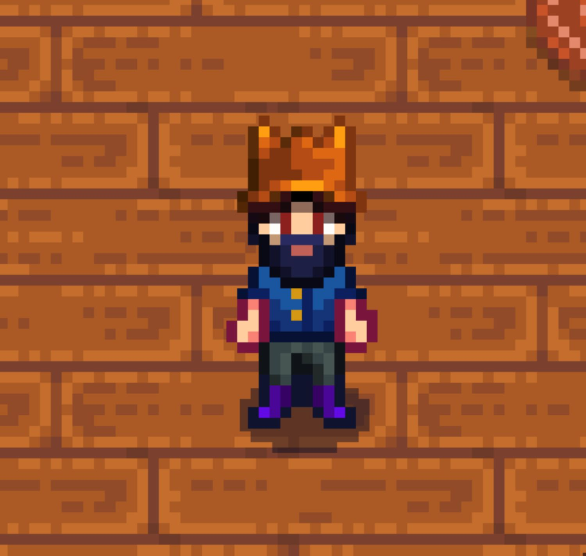
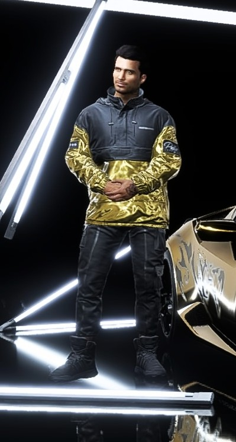

## Demographics

These visualizations are reflective of the data compiled from the first nineteen objects that were submitted to *You Can Begin Again*. The most commonly-used set of pronouns for participants was "he/him" at 33%, followed by "they/them" at 19%, "she/her" and "he/they" at 14%, "she/they" at 10%, and finally "any" pronouns and "neopronouns" at only 5% of participants (See Fig. 1).

There is, however, an interesting shift as one starts to look at the pronouns that participants assigned to their self-made avatars (See Fig. 2). Despite "he/him" pronouns only being used by 33% of the archive's participants, almost 50% gave their player characters (PCs) "he/him" pronouns. The second most common category is "they/them," which almost doubled from its initial 19% to be assigned to 32% of archive participants' PCs. The amount of people who utilized multiple pronoun sets (he/they, she/they, any pronouns) also reduced significantly, which is reflective of the fact that players are generally restricted to selecting one binary set of pronouns (he/him, they/them, she/her) in most standard character creators instead of being able to write their own or select multiple. This restriction can be understood as a result of the cost of recording multiple variations of character dialogue that are referring to the player character with each pronoun set.

This coincides with data on whether or not player's self-selected pronouns were congruent with the pronouns they assigned their avatars (See Fig. 3). Participants that use "he/him" were more likely than any other group to use the same set of pronouns for their player characters, while every other group was more likely to pick a set that did not match the pronouns that they use for themselves. On the other hand, participants who either used multiple sets of pronouns or any pronouns (including neopronouns) almost unilaterally did not give their player characters the same pronouns that they use for themselves. Only one participant, who uses "she/they" pronouns, broke away from this trend and also assigned "she/they" pronouns to her virtual avatar.

## Games

Out of all of the avatars to the archive, the most popular games for them to be made in were *Baldur's Gate III*, with 5 submissions, and *Stardew Valley*, with 3 submissions. The rest of the games represented in the archive only have one associated submission (See Fig. 4.).

Another thing of note is that the vast majority of these games are either single-player only or allow for solo play. Only three games - *Sea of Thieves*, *Team Fortress 2*, and *Runescape: Dragonwilds* - are solely multiplayer. Most games represented within the archive are also characterized by their narratives, with only the three aforementioned multiplayer games and *Minecraft* not containing some kind of 'story mode' for players to engage with. This reflects the larger trend of narrative-based games incorporating character customization mechanics as a means of encouraging immersion and the player's embodiment into their characters.

# Stories

The last point of analysis for the submissions contained within *You Can Begin Again* are the responses provided by the archive's participants. When prompted with a question regarding the connection between their virtual avatars and their gender identities, a few common themes emerged (See Fig. 5).

These commonalities, as pictured, are difficult to quantify. There was a repeated usage of terms like 'play,' 'gender,' 'game,' and 'character' for self-explanatory reasons, but attempts to adequately visualize shared experiences present within participant responses were unsuccessful. 

Instead, I would like to shift to a discussion of the similarity in *themes* across the archive's various objects. In many of the submissions, gamers relished  their ability to present however they wished without having their identities called into question. In [Crash's](https://isaaclriddle.github.io/youcanbeginagain/submissionimg/198417095_Crash_avatar/) (any pronouns) responses to the survey, for example, they identified how liberating it felt for his player character, pictured here, to have the freedom to present however she wanted her to look without the legitimacy of her identity being placed under scrutiny (See Fig. 6).

[Damascus](https://isaaclriddle.github.io/youcanbeginagain/submissionimg/169141966_Damascus_avatar/) (he/him) too spoke of enjoying this freedom (See Fig. 7). In his remark, he discusses the ability to wear things like "croptops" while still having his pronouns and identity as a male accepted without debate.

To conclude, I want to highlight [Dekarios'](https://isaaclriddle.github.io/youcanbeginagain/submissionimg/170014075_eillurdekarios_avatar/) (any pronouns) submission, which I believe serves as an encapsulation of the themes and experiences that I hoped to catalogue and record in this project (See Fig. 8). When prompted to discuss the relationship between her gender identity and his player character, they said:

> “"My gender identity is up in the air. Mostly, I feel Agender and don't necessarily care how I'm addressed. Sometimes I feel nonbinary and would prefer to be addressed as they/them. However, I don't feel comfortable expressing my preferred identity in real life, so I just default to my birth sex since that's easier. In video games, however, I can become whoever I want…. Character creators have allowed me to explore how I see myself and how I want to be seen by others…Games like Baldur's Gate 3 that let me physically see my player character have helped me feel more comfortable with myself. Even if the world would find me strange, *I have a sense of internal acceptance where I know it's okay to not fit into what someone expects of me*."	

